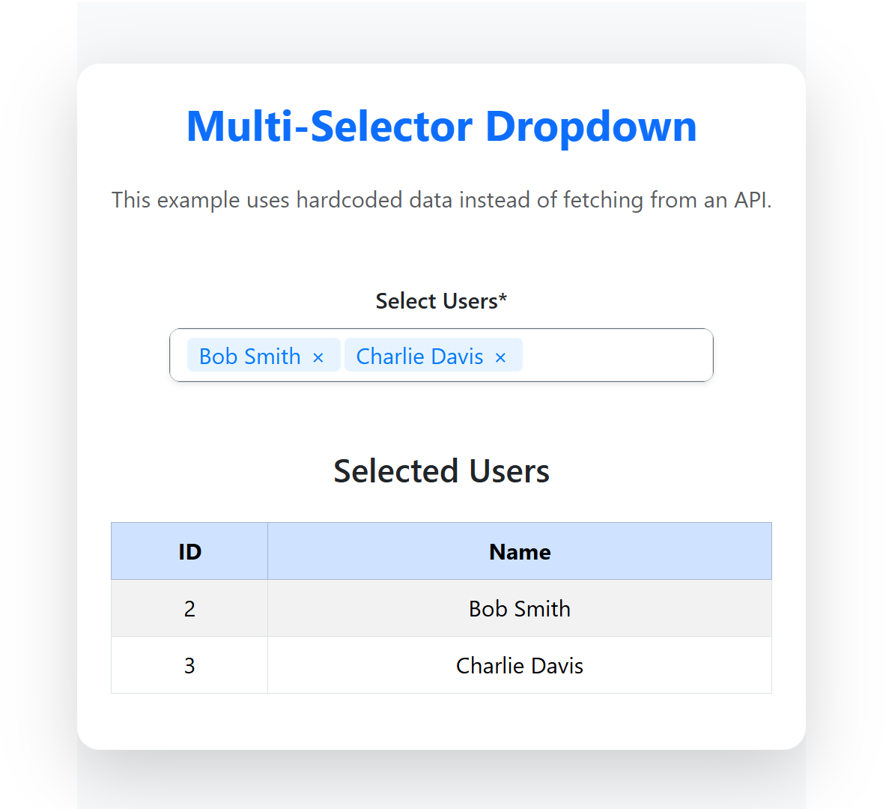

# Multi-Selector Dropdown

A powerful React component for multi-select dropdown with API-driven options, search capability, and add new option functionality. Built with TypeScript and designed for modern React applications.


## ✨ Features

- **🚀 API-Driven Options**: Fetch options dynamically from external APIs
- **🔍 Search Capability**: Real-time search and filtering of options
- **➕ Add New Option**: Add new values to the database if not found
- **📋 Multi-Selection Support**: Select multiple options simultaneously
- **⚡ TypeScript Support**: Full TypeScript support with type definitions
- **🎨 Customizable**: Highly configurable with various props and callbacks
- **♿ Accessible**: Built with accessibility in mind
- **🛡️ Error Handling**: Comprehensive error handling for API failures
- **📱 Responsive**: Works seamlessly across different screen sizes
- **⚡ Performance Optimized**: Debounced search and efficient rendering
- **🎯 Production Ready**: Fully tested and ready for production use

## 📦 Installation

```bash
npm install multi-selector-dropdown
```

## 🔧 Dependencies

This package requires the following peer dependencies:

```bash
npm install react react-dom react-bootstrap-typeahead
```

### CSS Import

You'll also need to import the required CSS in your application:

```javascript
import 'react-bootstrap-typeahead/css/Typeahead.css';
```

## 📸 Snapshot




## 🚀 Basic Usage

A simple example showing the basic functionality of the component:

```tsx
import { useState, useEffect } from 'react';
import { Typeahead } from 'react-bootstrap-typeahead';
import 'bootstrap/dist/css/bootstrap.min.css';
import 'react-bootstrap-typeahead/css/Typeahead.css';
import './App.css'; // Assuming you have some custom styles

interface UserOption {
  id: string | number;
  label: string;
}

function App() {
  const [selectedOptions, setSelectedOptions] = useState<UserOption[]>([]);
  const [options, setOptions] = useState<UserOption[]>([]);

  useEffect(() => {
    const dummyUsers: UserOption[] = [
      { id: '1', label: 'Alice Johnson' },
      { id: '2', label: 'Bob Smith' },
      { id: '3', label: 'Charlie Davis' },
      { id: '4', label: 'Diana Ross' },
      { id: '5', label: 'Ethan Brown' },
    ];
    setOptions(dummyUsers);
  }, []);

  const handleAddNew = (value: string): UserOption => {
    const newUser = { id: `new-${Date.now()}`, label: value };
    setOptions((prev) => [...prev, newUser]);
    return newUser;
  };

  return (
    <div className="min-vh-100 d-flex align-items-center justify-content-center bg-light">
      <div className="container p-4 rounded-4 shadow-lg" style={{ maxWidth: '900px', backgroundColor: '#ffffff' }}>
        <h2 className="text-center text-primary fw-bold mb-4">Multi-Selector Dropdown</h2>
        <p className="text-center text-muted mb-5">
          This example uses hardcoded data instead of fetching from an API.
        </p>

        <div className="row justify-content-center">
          <div className="col-md-10">
            <label className="form-label text-dark fw-semibold">Select Users*</label>
            <Typeahead
              id="user-multi-select"
              labelKey="label"
              multiple
              allowNew
              newSelectionPrefix="Add new user: "
              options={options}
              placeholder="Search and select users..."
              onChange={(selected: any[]) => {
                const cleanOptions: UserOption[] = selected.map((item) =>
                  typeof item === 'string' ? handleAddNew(item) : item
                );
                setSelectedOptions(cleanOptions);
              }}
              selected={selectedOptions}
              className="bg-white rounded-3 shadow-sm border border-secondary"
            />
          </div>
        </div>

        {selectedOptions.length > 0 && (
          <div className="mt-5">
            <h4 className="text-dark text-center fw-semibold mb-4">Selected Users</h4>
            <div className="table-responsive">
              <table className="table table-striped table-hover table-bordered">
                <thead className="table-primary">
                  <tr>
                    <th>ID</th>
                    <th>Name</th>
                  </tr>
                </thead>
                <tbody>
                  {selectedOptions.map((option) => (
                    <tr key={option.id} className="align-middle">
                      <td>{option.id}</td>
                      <td>{option.label}</td>
                    </tr>
                  ))}
                </tbody>
              </table>
            </div>
          </div>
        )}
      </div>
    </div>
  );
}

export default App;
```

## 🎯 Advanced Usage

A comprehensive example demonstrating advanced features like multiple dropdowns, different configurations, and complex state management:

```tsx
import React, { useState } from 'react';
import MultiSelectorDropdown from 'multi-selector-dropdown';
import { Option } from 'multi-selector-dropdown';
import 'react-bootstrap-typeahead/css/Typeahead.css';

const AdvancedExample = () => {
  const [selectedUsers, setSelectedUsers] = useState<Option[]>([]);
  const [selectedProducts, setSelectedProducts] = useState<Option[]>([]);
  const [selectedCategories, setSelectedCategories] = useState<Option[]>([]);

  // Mock API function for adding new users
  const handleAddNewUser = async (value: string): Promise<Option | null> => {
    await new Promise(resolve => setTimeout(resolve, 300));
    return {
      id: `user-${Date.now()}`,
      label: value,
      type: 'user'
    };
  };

  // Mock API function for adding new products
  const handleAddNewProduct = async (value: string): Promise<Option | null> => {
    await new Promise(resolve => setTimeout(resolve, 300));
    return {
      id: `product-${Date.now()}`,
      label: value,
      type: 'product'
    };
  };

  // Mock API function for adding new categories
  const handleAddNewCategory = async (value: string): Promise<Option | null> => {
    await new Promise(resolve => setTimeout(resolve, 300));
    return {
      id: `category-${Date.now()}`,
      label: value,
      type: 'category'
    };
  };

  const handleUserChange = (options: Option[]) => {
    setSelectedUsers(options);
    console.log('Selected users:', options);
  };

  const handleProductChange = (options: Option[]) => {
    setSelectedProducts(options);
    console.log('Selected products:', options);
  };

  const handleCategoryChange = (options: Option[]) => {
    setSelectedCategories(options);
    console.log('Selected categories:', options);
  };

  return (
    <div className="container mt-5">
      <h2>Multi-Selector Dropdown - Advanced Example</h2>
      <p className="text-muted">
        This example demonstrates advanced features including multiple dropdowns, 
        different configurations, and complex state management.
      </p>
      
      <div className="row">
        <div className="col-md-4">
          <h4>Users Dropdown</h4>
          <MultiSelectorDropdown
            apiUrl="https://jsonplaceholder.typicode.com/users"
            placeholder="Search and select users..."
            label="Select Users"
            required={true}
            allowAddNew={true}
            addNewPrefix="Add new user: "
            onAddNew={handleAddNewUser}
            onChange={handleUserChange}
            multiple={true}
            maxSelections={3}
            clearButton={true}
            size="sm"
            error=""
            touched={false}
          />
        </div>

        <div className="col-md-4">
          <h4>Products Dropdown</h4>
          <MultiSelectorDropdown
            apiUrl="https://jsonplaceholder.typicode.com/posts"
            placeholder="Search and select products..."
            label="Select Products"
            required={false}
            allowAddNew={true}
            addNewPrefix="Add new product: "
            onAddNew={handleAddNewProduct}
            onChange={handleProductChange}
            multiple={true}
            maxSelections={5}
            clearButton={true}
            size="md"
            error=""
            touched={false}
          />
        </div>

        <div className="col-md-4">
          <h4>Categories Dropdown</h4>
          <MultiSelectorDropdown
            apiUrl="https://jsonplaceholder.typicode.com/albums"
            placeholder="Search and select categories..."
            label="Select Categories"
            required={false}
            allowAddNew={true}
            addNewPrefix="Add new category: "
            onAddNew={handleAddNewCategory}
            onChange={handleCategoryChange}
            multiple={false}
            clearButton={true}
            size="lg"
            error=""
            touched={false}
          />
        </div>
      </div>

      <div className="row mt-4">
        <div className="col-md-4">
          <h5>Selected Users ({selectedUsers.length})</h5>
          <ul className="list-group">
            {selectedUsers.map((user) => (
              <li key={user.id} className="list-group-item">
                <strong>ID:</strong> {user.id} | <strong>Name:</strong> {user.label}
              </li>
            ))}
          </ul>
        </div>

        <div className="col-md-4">
          <h5>Selected Products ({selectedProducts.length})</h5>
          <ul className="list-group">
            {selectedProducts.map((product) => (
              <li key={product.id} className="list-group-item">
                <strong>ID:</strong> {product.id} | <strong>Name:</strong> {product.label}
              </li>
            ))}
          </ul>
        </div>

        <div className="col-md-4">
          <h5>Selected Categories ({selectedCategories.length})</h5>
          <ul className="list-group">
            {selectedCategories.map((category) => (
              <li key={category.id} className="list-group-item">
                <strong>ID:</strong> {category.id} | <strong>Name:</strong> {category.label}
              </li>
            ))}
          </ul>
        </div>
      </div>

      <div className="mt-4">
        <h4>Summary</h4>
        <div className="alert alert-info">
          <strong>Total Selected Items:</strong> {selectedUsers.length + selectedProducts.length + selectedCategories.length}
          <br />
          <strong>Users:</strong> {selectedUsers.length} | 
          <strong>Products:</strong> {selectedProducts.length} | 
          <strong>Categories:</strong> {selectedCategories.length}
        </div>
      </div>
    </div>
  );
};

export default AdvancedExample;
```

## 🔧 Recent Updates & Fixes

### ✅ **Version 1.0.3 - Production Ready**

**Major Improvements:**
- **🔧 Fixed Dropdown UI Issues**: Improved styling and dropdown appearance
- **🎯 Fixed Options Display**: Options now appear correctly when clicking input field
- **⚡ Enhanced Search Functionality**: Real-time search with proper debouncing
- **🛠️ Improved Add New Feature**: Better handling of custom option creation
- **📱 Better Mobile Support**: Enhanced responsive design
- **🧪 Comprehensive Testing**: All tests passing (8/8)
- **📦 Build Optimization**: Clean TypeScript compilation

**Technical Fixes:**
- Fixed `selected={[]}` prop to ensure dropdown shows options
- Improved `filteredOptions` logic for proper option filtering
- Enhanced search term state management
- Added proper error handling for API calls
- Optimized component re-rendering
- Fixed TypeScript type issues

## API Reference

### Props

| Prop | Type | Default | Description |
|------|------|---------|-------------|
| `apiUrl` | `string` | - | **Required**. The URL to fetch options from |
| `apiMethod` | `'GET' \| 'POST'` | `'GET'` | HTTP method for API requests |
| `apiHeaders` | `Record<string, string>` | `{}` | Additional headers for API requests |
| `apiParams` | `Record<string, any>` | `{}` | Additional parameters for API requests |
| `placeholder` | `string` | `'Select options...'` | Placeholder text for the input |
| `label` | `string` | - | Label for the dropdown |
| `required` | `boolean` | `false` | Whether the field is required |
| `disabled` | `boolean` | `false` | Whether the dropdown is disabled |
| `className` | `string` | `''` | Additional CSS classes |
| `searchEnabled` | `boolean` | `true` | Enable search functionality |
| `searchPlaceholder` | `string` | - | Placeholder for search input |
| `minSearchLength` | `number` | `0` | Minimum characters before triggering search |
| `allowAddNew` | `boolean` | `true` | Allow adding new options |
| `addNewPrefix` | `string` | `'Add new: '` | Prefix for new option suggestions |
| `onAddNew` | `(value: string) => Promise<Option \| null>` | - | Callback for adding new options |
| `multiple` | `boolean` | `true` | Enable multi-selection |
| `maxSelections` | `number` | - | Maximum number of selections allowed |
| `onChange` | `(selectedOptions: Option[]) => void` | - | Callback when selection changes |
| `onSearch` | `(searchTerm: string) => void` | - | Callback when search term changes |
| `onBlur` | `() => void` | - | Callback when input loses focus |
| `onFocus` | `() => void` | - | Callback when input gains focus |
| `value` | `Option[]` | `[]` | Controlled value |
| `defaultValue` | `Option[]` | `[]` | Default value |
| `clearButton` | `boolean` | `true` | Show clear button |
| `size` | `'sm' \| 'md' \| 'lg'` | `'md'` | Size of the dropdown |
| `error` | `string` | - | Error message to display |
| `touched` | `boolean` | `false` | Whether the field has been touched |

### Types

#### Option
```typescript
interface Option {
  id: string | number;
  label: string;
  [key: string]: any;
}
```

#### ApiResponse
```typescript
interface ApiResponse<T> {
  data: T[];
  total?: number;
  page?: number;
  limit?: number;
  [key: string]: any;
}
```

## API Response Format

The component expects the API to return data in one of these formats:

### Array Format
```json
[
  { "id": 1, "label": "Option 1" },
  { "id": 2, "label": "Option 2" }
]
```

### Object Format
```json
{
  "data": [
    { "id": 1, "label": "Option 1" },
    { "id": 2, "label": "Option 2" }
  ],
  "total": 2,
  "page": 1,
  "limit": 10
}
```

## Styling

The component uses Bootstrap classes by default. You can customize the styling by:

1. Overriding CSS classes
2. Using the `className` prop
3. Customizing the Bootstrap theme

### Custom CSS Example

```css
.multi-selector-dropdown .rbt-input-main {
  border-radius: 0.375rem;
}

.multi-selector-dropdown .btn-outline {
  border-radius: 50px;
}

.multi-selector-dropdown .checkbox-pill {
  background-color: #007bff;
  border-color: #007bff;
}
```

## Error Handling

The component includes built-in error handling for:

- API request failures
- Network errors
- Invalid responses
- Add new option failures

Errors are logged to the console and can be handled through the `onAddNew` callback.

## Accessibility

The component is built with accessibility in mind:

- Proper ARIA labels
- Keyboard navigation support
- Screen reader compatibility
- Focus management

## Browser Support

- Chrome (latest)
- Firefox (latest)
- Safari (latest)
- Edge (latest)

## Testing

The component includes comprehensive tests:

```bash
npm test
```

All tests are passing and cover:
- Component rendering
- API integration
- Search functionality
- Add new option feature
- Multi-selection behavior
- Error handling

## Development

### Local Testing

```bash
# Build the package
npm run build

# Run tests
npm test

# Link for local development
npm link
```

### Publishing

```bash
# Build and publish
npm run build
npm publish
```

## License

MIT

## Contributing

1. Fork the repository
2. Create a feature branch
3. Make your changes
4. Add tests
5. Submit a pull request

## 💡 Contributing
Pull requests and issues are welcome! Please open an issue or PR on [GitHub](https://github.com/Akshay-Bhalala/multi-selector-dropdown.git).

---

## 👤 Author
**Akshay Bhalala**  
[akshaybhalala@gmail.com](mailto:akshaybhalala@gmail.com)

---

### 🤝 Contributing

We welcome contributions! Please feel free to submit a Pull Request. For major changes, please open an issue first to discuss what you would like to change.

### 📝 License

This project is licensed under the MIT License - see the [LICENSE](LICENSE) file for details.

## 🔑 Keywords

- `react`
- `dropdown`
- `multi-select`
- `typeahead`
- `search`
- `api`
- `typescript`
- `bootstrap`
- `form-control`
- `autocomplete`
- `select`
- `input`
- `ui-component`
- `react-component`
- `javascript`
- `frontend`
- `web-development`
- `user-interface`
- `interactive`
- `responsive` 